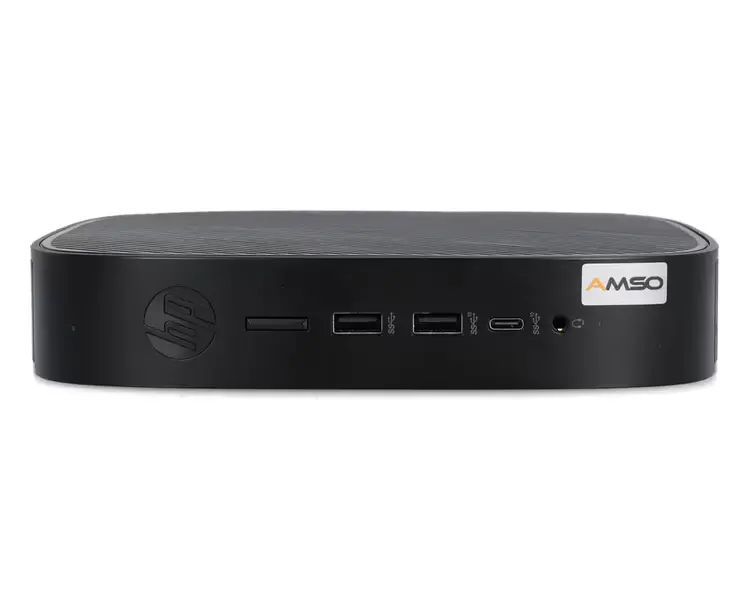
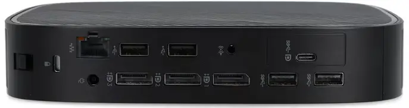
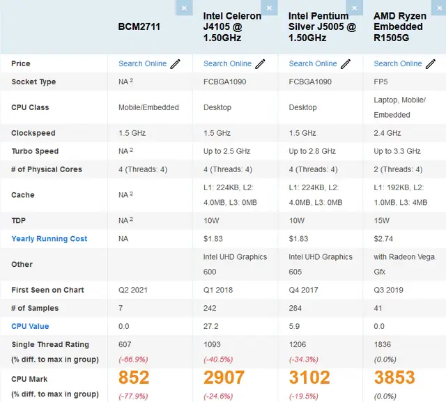

## General

The **HP T640 Thin Client Mini PC** is an excellent choice for those seeking a compact and versatile computing solution. Designed for efficiency and flexibility, it serves as a powerful alternative to devices like the Raspberry Pi or other thin clients such as the Dell Wyse 5070 and Fujitsu Futro S740. With its passively cooled design, robust hardware, and extensive connectivity options, the HP T640 is ideal for applications ranging from home servers to media centers or even console emulation setups.

## Stats and Technical

The HP T640 packs impressive hardware in its small form factor:

- **CPU**: AMD Ryzen™ R1505G (2 cores / 4 threads, 12W-25W TDP, passively cooled)
- **GPU**: Radeon™ Vega 3 Graphics (integrated, supports up to 4K @60Hz via DisplayPort)
- **RAM**: 8GB DDR4 (expandable up to 64GB across two SO-DIMM slots)
- **Storage**:
  - m.2 NVMe SSD slot (supports sizes 2230, 2242, and 2280)
  - Compatible with both m.2 SATA and NVMe SSDs
- **Ports**:
  - Front: 2x USB-A 3.1 Gen 2, 1x USB-C 3.1 Gen 2 (data only)
  - Rear: 2x USB-A 3.1 Gen 1, 2x USB-A 2.0, 1x USB-C with DP & Power Delivery
  - Video Output: 3x DisplayPort (up to three simultaneous monitors at 4K @60Hz)
  - Audio I/O: Aux-In & Aux-Out
- **Networking**:
  - Gigabit LAN (Realtek RTL8111HSH GbE)
  - m.2 slot for WiFi/Bluetooth modules
- **Security**:
  - TPM 2.0 and Secure Boot support via BIOS
- **Dimensions**: Compact at just **3.5 x 19.6 x 19.6 cm**, weighing approximately **1kg**
- **Operating System**: None pre-installed.
- **Pricing**: Depends on whats configured but used available from **50€**

## Consumption

One of the standout features of the HP T640 is its low power consumption. With a TDP capped at around **15W**, this device is highly energy-efficient while maintaining solid performance. Its passive cooling design eliminates the need for fans, making it silent during operation—perfect for environments where noise reduction is critical.

- With running Ubuntu Server 24.04 in idle we get about **3W** usage.
- Under low load Proxmox with some LXCs and a VM maybe around **4-6W**

## Performance

The AMD Ryzen R1505G CPU with Vega 3 Graphics delivers significantly better performance compared to typical ARM-based devices like the Raspberry Pi. Key performance highlights include:

- **CPU Performance**:
   - The Ryzen R1505G outperforms processors like the Intel Celeron J4105 or Pentium Silver J5005 commonly found in other mini PCs.
   - It offers ample power for multitasking, light productivity tasks, and media playback.
- **GPU Performance**:
   - The integrated Vega 3 GPU supports hardware transcoding and can handle console emulators smoothly.
   - It enables multi-monitor setups with up to three displays at **4K @60Hz**, making it ideal for productivity or digital signage applications.

When compared to competitors like the Dell Wyse 5070 or Fujitsu Futro S740, the HP T640 excels in several areas:
- Support for up to **64GB of RAM**, compared to just **30GB on the Wyse** and **16GB on the Futro S740**.
- A more powerful integrated GPU for graphics-intensive tasks.
- Flexible m.2 NVMe SSD support across multiple sizes (2230, 2242, and 2280).

- BCM2711: RaspberryPi 4

## Use cases

- RaspberryPi alternative for hosting different kind of services
- MediaServer with Jellyfin / Plex combined with *arr Stack (Transcoding works great)
- Small emulator up to PS2

## Side Notes

The HP T640 also shines as a Raspberry Pi alternative due to its superior expandability and performance:

- Expandable RAM up to **64GB**, compared to the fixed memory on Raspberry Pi boards.
- A much more powerful CPU that can handle complex workloads.
- Built-in m.2 slots for NVMe storage and WiFi/Bluetooth modules.
- A wider range of ports and connectivity options.
- Comes with a robust case and power supply included.

While it lacks pre-installed storage or an operating system, this provides flexibility for users to customize their setup according to specific needs. Whether you're building a home server, media center, or lightweight desktop replacement, the HP T640 Thin Client Mini PC offers incredible value in a compact package.

### How to update BIOS

- FAT32 formatted stick
- The name of the USB stick must be `HP_TOOLS`
- Extract sp152017.exe (with Windows or probably works with 7zip)
- Copy the `toolless` directory into root of the stick
- Hint: Virtualization should be deactivated for BIOS upgrade

### References
- https://www.mydealz.de/deals/hp-t640-terminal-mini-pc-amd-ryzen-r1505-passiv-aufrustbarer-ram-m2-nvme-slot-usb-c-mit-dp-3xdp-refurbished-dell-wyse-futro-alternative-2421243#comments (German information)
- https://forums.servethehome.com/index.php?resources/introduction-to-the-hp-t640-thin-client-your-cheap-little-amd-nuc7-alternative.46/

## Conclusion

The HP T640 is a nice little machine (of course a lot bigger than a Pi) with nice performance but low power consumtion with Linux.
It is very suitable for small home projects and automations and also home media servers.
